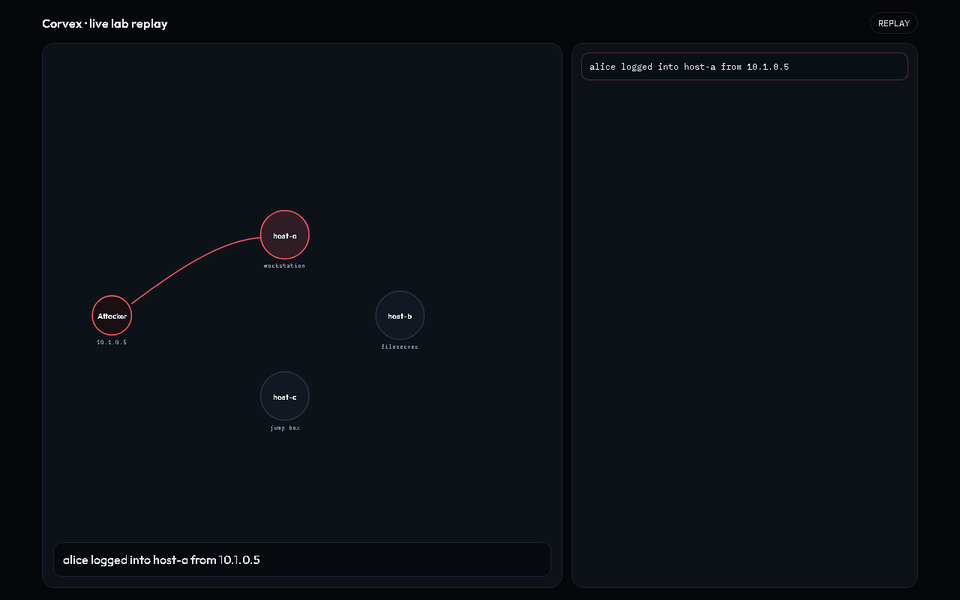
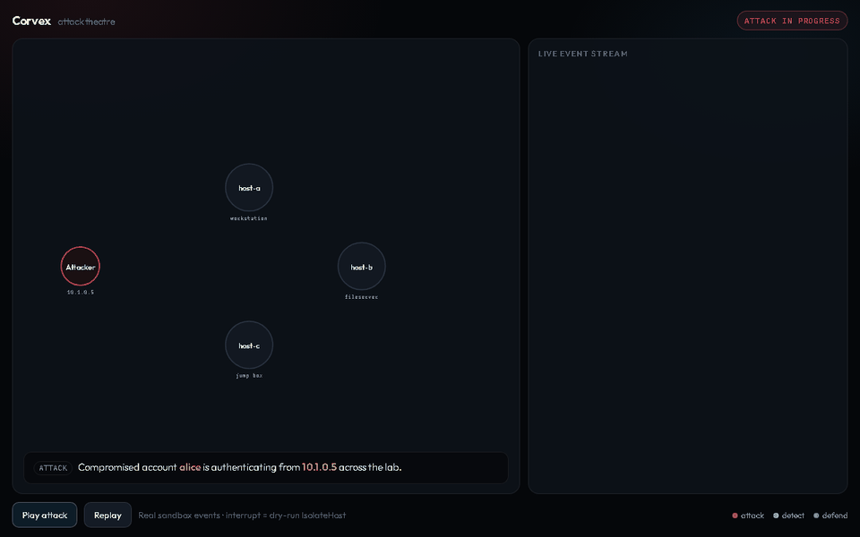

# Corvex

Multi-host **campaign correlator** — stitches weak signals across machines into one attack timeline.

Observe and correlate first. Live containment stays locked behind safety controls.

## Demos

### 30s walkthrough


[Full MP4](docs/assets/corvex-pitch-30s.mp4)

### Live Docker lab

Real HTTP attack across virtual hosts; Corvex isolates mid-campaign; retries return `403`.



[Full MP4](docs/assets/corvex-live-lab.mp4)

### Attack theatre

Lateral-auth hop across `host-a` / `host-b` / `host-c`.



[Full MP4](docs/assets/corvex-attack-theatre.mp4)

## Quick start

Requires Python 3.9+.

```bash
git clone https://github.com/Siddarthb07/corvex.git
cd corvex
python -m pip install -e ".[dev]"

# Replay a sample multi-host attack (auto-creates ~/.corvex/enrollment.json)
corvex replay train/train-lateral.jsonl --out-dir runs/demo

# Open the monitor (prints URLs after bind)
corvex dash --run-dir runs/demo
```

| Surface | Path (after `corvex dash`) |
|---------|----------------------------|
| Monitor | `/` — campaigns + eval + safety controls |
| Prevention log | `/logs.html` |

Defaults bind to loopback. Share on a lab LAN (view-only checklist from remote hosts):

```bash
corvex dash --host 0.0.0.0 --port 8765 --run-dir runs/demo
# browse http://<this-machine-ip>:8765/
```

CLI: `corvex` (legacy alias `cfuse`). Optional: `corvex init` to create enrollment without replaying.

## Results (sealed held-out)

Synthetic multi-host packs. **Care vs commercial tools: unproven.** We do not publish a lone “accuracy” — recall without precision (or without a benign false-alarm rate) is how correlators look strong and fail in a SOC.

### Detection

| Metric | Corvex | Notes |
|--------|--------|--------|
| Precision | **1.00** | Flagged campaigns that matched ground truth |
| Recall | **1.00** | True multi-host campaigns recovered |
| Campaign F1 | **1.00** | Harmonic mean of P+R |
| Precision@1 | **1.00** | Top-ranked campaign correct |
| Benign false-campaign rate | **0.00** | Held-out benign packs (**N=1**) |
| Time-to-correlate | **~0.012 s** | First ingest → campaigns (lab machine) |

**N:** attack packs **2** (TP=2, FP=0, FN=0); benign packs **1**. Train has **N_benign=0**. Thin on purpose until expanded — not a train/held-out discrepancy.

### vs single-host baseline (why a correlator)

| | Corvex | B1 (per-host naive) |
|--|--------|---------------------|
| F1 | **1.00** | **0.00** |
| Recall | **1.00** | **0.00** |
| Precision | **1.00** | **0.00** |
| Benign false-campaign rate | **0.00** | **1.00** |

B1 misses the multi-host campaigns and still cries wolf on benign traffic. That gap is the premise — not the absolute Corvex score alone.

B2 (SIEM-style joins) and detector-only also hit F1 1.00 on this sealed set. On **train**, detector-only was **0.89** vs correlator **1.00** — fusion helps there; held-out does not separate them yet. Honest limit of this pack grammar.

### Held-out vs train

| Split | Precision | Recall | F1 | Benign FCR | TTU |
|-------|-----------|--------|-----|------------|-----|
| Train (dev only) | 1.00 | 1.00 | 1.00 | n/a (N=0) | ~0.011 s |
| Held-out (sealed) | 1.00 | 1.00 | 1.00 | 0.00 (N=1) | ~0.012 s |

Train is **context**, not the sealed claim. Small gap ≠ real-world generalization.

### By attack pattern (held-out)

| Family | Precision | Recall | F1 | Benign FCR |
|--------|-----------|--------|-----|------------|
| lateral (OOD timing) | 1.00 | 1.00 | 1.00 | — |
| exfil | 1.00 | 1.00 | 1.00 | — |
| benign multi-host | — | — | — | **0.00** |

### Contain dry-run (`IsolateHost`, not live)

| Metric | Held-out |
|--------|----------|
| Hosts proposed | 6 |
| Correct isolates | 6 |
| False isolates | **0** |
| False-isolate rate | **0.00** |

`CORVEX_CONTAIN=0`. A future nonzero false-isolate rate gets published, not footnoted.

**Proves (narrow):** Sealed synthetic packs; pre-registered P+R + benign FCR + TTU bars; beats B1; dry-run host sets clean.  
**Does not prove:** Real malware defense, SOC workload cut, commercial parity, or that live contain is safe to arm.

Full write-up: [`reports/RESULTS.md`](reports/RESULTS.md).

## Bring your own events

```bash
corvex ingest-byo path/to/export.jsonl --out-bus runs/prod/events.jsonl
corvex dash
```

Enrollment / HMAC secrets live **outside** the repo (`~/.corvex/` by default). Do not commit keys.

Public train packs are re-signed with your local enrollment on replay so a clean clone works without sealed held-out material.

## Docker attack lab

Needs Docker. Sources live in `labs/live/`:

```bash
python scripts/run_live_lab.py
```

Spins up 3 virtual hosts + attacker + Corvex on an isolated bridge network. Same flow as the live-lab demo.

## What works today vs later

| Capability | Status |
|------------|--------|
| Correlator + monitor + prevention log | Ready |
| Replay / BYO JSONL ingest | Ready |
| Sensors + JetStream/mTLS bus | Stub / gated |
| Live host isolate | Dry-run only (`CORVEX_CONTAIN=0`) |

```text
[Host sensors] --mTLS--> [Event bus] --> [Corvex correlator]
                                              |
                                              v
                                    Prevention log + Monitor
                                              |
                         safety checklist complete
                         + contain switch armed
                                              v
                                    Contain executor (IsolateHost)
```

## Safety

Dashboard toggles map to `reports/security_l1_checklist.json`. They gate detect → act:

- Prove sensor identity (mTLS)
- Signed ≠ allowed (authz separate from HMAC)
- Named actions only (no free-form shell)
- Anti-replay, dual control, blast-radius caps
- Fail closed, tamper-evident log, off-bus kill switch

Flipping toggles does **not** unlock real LAN quarantine. When the dash is bound on `0.0.0.0`, checklist POSTs are still **loopback-only**.

Details: [`corvex/contain/CHECKLIST.md`](corvex/contain/CHECKLIST.md) · [`docs/contain.md`](docs/contain.md)

## Architecture

```text
Sensors / Feeder / BYO-JSONL
        → EventBus (JSONL now; JetStream+mTLS later)
        → detectors (pure functions)
        → correlator
        → CampaignStore + Prevention log
        → Contain (gated)
```

## Docs

- [`SECURITY.md`](SECURITY.md) · [`THREAT_MODEL.md`](THREAT_MODEL.md) · [`LICENSE`](LICENSE)
- [`docs/contain.md`](docs/contain.md) · [`reports/RESULTS.md`](reports/RESULTS.md)

## License

MIT — see [`LICENSE`](LICENSE).
