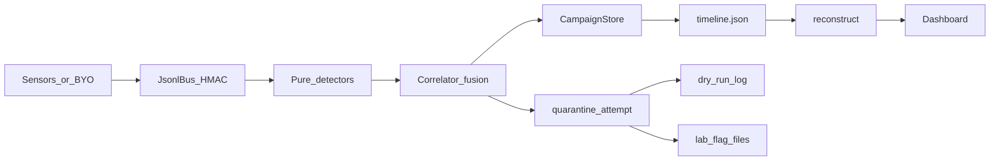

# Corvex — Deep Dive

A from-scratch, interview-grade walkthrough of every design choice and every code path that matters in `Siddarthb07/corvex`. After this you should be able to (a) redraw the architecture on a whiteboard, (b) defend every honesty claim under grilling, and (c) recreate the correlator + reconstruct + quarantine loop without looking at the repo.

Assumes you can read Python. Does **not** assume prior SOC / ATT&CK expertise — those terms are built up as needed.

---

## 0. What this project actually is, in one paragraph

Corvex is a **multi-host campaign correlator**. It ingests signed telemetry envelopes from several machines, runs weak single-purpose detectors, then **fuses** overlapping signals into campaigns — sets of hosts + stage labels that are more meaningful together than as separate alerts. It can **reconstruct** a human-readable attack timeline from those campaigns (and will say `partial` / `insufficient_evidence` when it cannot), and it can **attempt quarantine** via dry-run logs or lab sandbox flags — never by pretending a real OS firewall acted when it did not. There is **no LLM** and **no cloud API key**. The product posture is: observe and correlate first; live contain gated and currently unimplemented for real hosts.

---

## 1. The real-world problem (why anyone cares)

Modern attackers rarely live on one box. A common pattern:

1. Steal or buy credentials.
2. Log into host A.
3. Reuse the same account (or a hop account) on host B, then C.
4. Optionally scan, then drip small amounts of data out to an external IP.

A per-host EDR alert might fire three times and look like three unrelated events. A SIEM *can* join them, but correlation jobs are often brittle, noisy, or sold as platform theater. Corvex’s wedge is narrower and more honest: **prove that cross-host fusion beats naive per-host baselines on sealed packs**, expose where it fails on break-tests, and keep containment claims locked until the safety checklist and a real executor exist.

**Killer interview line:** *“I built a campaign unit — not another alert dashboard — and I refuse to claim live quarantine or full attack rebuild when the evidence isn’t there.”*

---

## 2. Concepts from zero

### 2.1. What is a “campaign”?

In Corvex, a **campaign** is not “APT29” and not a CVE. It is a structured object:

- `campaign_id` — stable-ish string for this fused cluster
- `host_ids` — the set of machines involved
- `stages` — ordered-ish list of stage dicts (`lateral_auth`, `micro_exfil`, `recon_fanout`, …)
- `evidence` — detector hits that justified the fusion
- `score` — correlator confidence heuristic (not calibrated probability)

Stored in `CampaignStore` as JSONL (`corvex/store.py`). Schema version is explicit so runs don’t silently drift.

### 2.2. Event envelope + HMAC

Every event is an **EventEnvelope**: schema version, event id, producer id, host id, UTC timestamp, nonce, payload type, payload, HMAC.

Why HMAC? So a stranger’s BYO JSONL and the lab bus share one trust story: events are signed with a secret from **local enrollment** (`~/.corvex/enrollment.json`). That is **not** mTLS, not enterprise IAM, and not “we authenticated the attacker.” It is “this enrollment key signed this envelope.”

Grilling trap: *“So you’re secure because of HMAC?”*  
Answer: *“HMAC proves enrollment-scoped integrity of the bus for lab/BYO. Containment authz is a separate L1 checklist item (`authz_neq_sig`) — signature alone must never equal permission to isolate.”*

### 2.3. Detectors vs correlator

**Detectors** (`corvex/detectors.py`) are pure functions: window of events → list of `Signal`. No I/O, no clock, no RNG (CI enforces purity). Three shipped detectors:

| Detector | Idea | Weak signal |
|----------|------|-------------|
| `lateral_auth` | Same user authenticates on ≥2 hosts | Credential reuse / lateral movement hint |
| `micro_exfil` | Small egress bursts from ≥2 hosts to same dst | Slow drip exfil hint |
| `recon_fanout` | One host connects to many distinct destinations | Scan-like recon |

**Detector-only mode** turns each detector *key* into its own campaign (user / dst / host) **without** merging across keys. That is deliberate: if detector-only and fusion both score F1 1.0 on a sealed set, you have **not** proven fusion’s value — you’ve proven the pack grammar is too easy. Publish that honesty.

**Correlator fusion** (`Correlator._fuse`) builds clusters from shared users and shared exfil destinations, attaches recon when it overlaps, then **transitively merges** overlapping clusters. Full recompute on ingest (batch posture for the current plan window).

### 2.4. ATT&CK tags (coarse, unverified)

Reconstruction maps stage names → technique IDs (e.g. `lateral_auth` → T1078, T1021). These are **hypotheses from names**, not forensic proof. Never claim “we detected T1059.001” from correlator output alone.

### 2.5. Quarantine modes

| Mode | Behavior | Honest sentence |
|------|----------|-----------------|
| `dry_run` | Log `IsolateHost` ActionEnvelope | “Proposed, not enforced.” |
| `lab_flag` | Write `isolated/{host}.flag` | “Sandbox only — virtual `/auth` returns 403.” |
| `blocked` | Refuse | “Cannot quarantine real hosts; no live executor.” |

`CORVEX_CONTAIN=0` is the product default. Flipping the env var without an executor still yields **blocked** honesty, not fake success (`corvex/contain/quarantine.py`).

---

## 3. End-to-end data flow

CLI spine:

1. `corvex replay pack.jsonl` → campaigns + `timeline.json` + `reconstruction.json`
2. `corvex reconstruct runs/...` → rebuild if needed
3. `corvex quarantine host-a,host-b --rationale "..."` → attempt with honesty
4. `corvex dash` → monitor campaigns, reconstruction gaps, quarantine capability

---

## 4. Code walkthrough (paths that matter)

### 4.1. `corvex/detectors.py`

Read `detect_lateral_auth` first. It is the clearest “why fusion exists” story: group by user, emit a signal per host when `|hosts| >= 2`. Same shape for micro-exfil by destination.

Whiteboard recreate: *hash user → set of hosts; if size ≥ 2, emit signals.*

### 4.2. `corvex/correlator.py`

- `ingest` dedups by `event_id`, appends, `_recompute`
- `_campaigns_from_signals` — detector-only, **per-key**, no cross-key union
- `_fuse` — build clusters, merge while host sets intersect
- Writes via `CampaignStore.upsert` + audit events

Grilling: *“Why full recompute?”*  
*“Batch honesty and simpler correctness for sealed eval. Streaming / JetStream is deferred until the observe wedge is real — architect flagged unversioned streaming contracts as a footgun.”*

### 4.3. `corvex/reconstruct.py`

`reconstruct_campaign`:

1. Walk stages → steps + ATT&CK tags
2. Collect **gaps** (unmapped stages, host/truth mismatch, thin evidence)
3. Set status: `empty` | `insufficient_evidence` | `partial` | `complete`
4. Attach `quarantine_plan_for` unless empty/insufficient
5. `to_manifest()` / `to_pack_ground_truth()` labeled **regression_only**

**Complete** means “complete relative to correlator output,” not “we recovered the full attacker playbook.” Say that out loud in interviews.

### 4.4. `corvex/contain/quarantine.py` + `dry_run.py`

`propose_action` always builds a typed envelope with `dry_run=True`.  
`execute_action` logs; live path raises `ContainGateError` / “not implemented.”  
`attempt_quarantine` is the honesty layer operators should call.

### 4.5. `corvex/dashboard.py`

Snapshot includes `reconstruction` and `quarantine` capability. UI surfaces aggregate rebuild status, per-campaign gaps, and quarantine mode — so the monitor cannot silently imply live contain.

### 4.6. Labs

`labs/live/corvex/defend.py` and break-test compose: mid-chain isolate via **flag files**. Demo videos were stripped from release assets on purpose — claim hygiene over pitch theater.

---

## 5. Eval honesty (what the numbers mean)

Sealed Stage A reports publish precision, recall, F1, Precision@1, benign false-campaign rate, TTU, vs B1, detector-only ablation, dry-run false-isolate rate.

**Known soft spot (say it before they ask):** on some held-out packs, correlator and detector-only both hit F1 1.0 — the pack grammar does not separate them. Train may show fusion lift. Fusion-chain packs and break-tests exist to stress the gap; numbers are not “real-attack proof” until non-author telemetry, stranger success, and real-N benign FCR gates pass.

Dry-run isolate metrics ask: *if we proposed IsolateHost on every predicted campaign host, what is false-isolate rate?* That is **counterfactual**, not “we isolated production.”

---

## 6. Recreate from scratch (90-minute drill)

1. Define envelope schema + HMAC sign/verify.
2. Implement three pure detectors + unit tests with fixed windows.
3. Implement detector-only campaigns (per key) and fusion with transitive merge.
4. Write `timeline.json` after a replay.
5. Implement reconstruction with explicit `partial` / `insufficient_evidence`.
6. Implement quarantine modes; assert blocked never reports `enforced: true`.
7. Render a dash snapshot that shows gaps and quarantine honesty.

Acceptance: a single-host “campaign” must **not** be advertised as a complete multi-host rebuild; quarantine without `LAB_DIR` must not claim host mutation.

---

## 7. Interview narrative (how to talk without sounding rehearsed)

**Opening (30s):**  
“Corvex stitches weak multi-host signals into campaigns. Detectors find the smoke; fusion decides it’s one fire. Reconstruction and quarantine are honesty-gated — I would rather say I can’t rebuild or can’t isolate than invent success.”

**If they push ‘is this enterprise-ready?’:**  
“No. It’s a lab/BYO campaign stitcher with sealed synthetic eval and a break-test lab. Live contain is locked. Windows 4624 → BYO is the thin real-sensor path.”

**If they push IISc / research cosplay:**  
Do not drag Corvex into the 10-day IISc vortex internship. Corvex is a separate security systems project. Keep institutional claims accurate elsewhere in the portfolio.

**If they ask ‘why not just Splunk?’:**  
“I’m not replacing SIEM. I’m making the campaign object and the fusion-vs-detector gap measurable and publishable — including when fusion doesn’t win.”

**If they ask about LLM detection:**  
“Deliberately none. I wanted deterministic detectors, sealed eval, and an audit trail I can defend line-by-line.”

---

## 8. Limits to memorize (engineering judgment signal)

- Batch correlator, full recompute — not a streaming SOC bus.
- Lab isolate ≠ network quarantine.
- ATT&CK tags are name maps, unverified.
- Reconstruction exports are regression tools, not Atomic Red Team packs.
- Author-designed ART manifests are useful break-tests; they are **not** stranger-proof real-attack evidence.
- NDA: Vegam text-to-SQL work is unrelated and must not be mixed into Corvex claims.

---

## 9. File map (cheat sheet)

| Path | Role |
|------|------|
| `corvex/detectors.py` | Pure signals |
| `corvex/correlator.py` | Fusion + detector-only |
| `corvex/store.py` | Campaign JSONL |
| `corvex/reconstruct.py` | Honest rebuild |
| `corvex/contain/dry_run.py` | Typed action envelopes |
| `corvex/contain/quarantine.py` | Attempt + honesty modes |
| `corvex/dashboard.py` | Monitor UI |
| `corvex/cli.py` | replay / reconstruct / quarantine / dash |
| `docs/how-corvex-works.md` | Beginner explainer |
| `labs/breaktest/` | 5-host ART-style stress lab |
| `future-plans.md` | Next moves without Stage-letter theater |

---

## 10. One-liner you can ship when the wedge is real

*“Corvex is a multi-host campaign correlator: sealed fusion-vs-detector eval, Windows auth → BYO path, honest reconstruction that admits gaps, and quarantine that dry-runs or lab-flags — and refuses to fake live isolate.”*

Until non-author + stranger + real-N FCR gates pass, keep “useful on real attacks” out of the README.

---

*End of deep dive. Update this file when live quarantine executor ships or claim gates pass — never before.*
